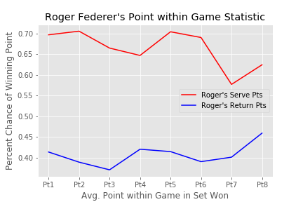
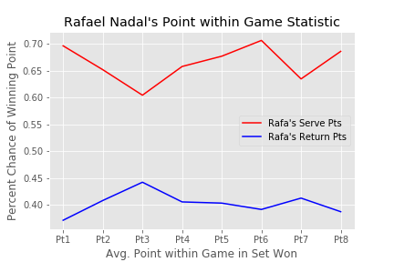
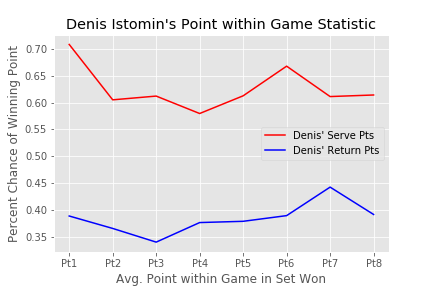

# Tennis Analysis: Not All Points and Games are Created Equal!
A point by point statistical analysis from over 70,000 documented ATP tour matches.

## Tennis Analysis
Tennis is a game of statistics.  What is your first serve percentage?  What is your winner-to-error ratio.  For instance, did you know that a good winner to error ratio is 1:2?  Why does that work?  Does it make sense?  Using data science,  one can deduce significant events which affect match outcomes.  This area has become big business as evidenced by sports gambling on tennis as well as players purchasing data science materials to aid in opponent game planning.   For more information on this topic, check out The Brain Game by Craig O”Shaughnessy.  He writes for the NY Times as well as provides Data Science reports to players for profit.

## Dataset: point_by_point.RData
My dataset came from Dr. Stephanie Kovalchik who works for Victoria University and Tennis Australia.  She graciously shared her RData repository named "Deuce" via Github. This Data set contains over 18 dataframes ranging from point win analysis to ATP (Association of Tennis Professionals) ranking history to historical betting-odds data. I chose to work with the point by point data set for my capstone.  This dataset has a particular column which keeps track of who won a particular point in the match as shown below.  To keep track of this data, there is a lot of slicing, dicing, and reformatting of the data.  The main columns used in this dataset were "Player1", "Player2", "Match Score", "Winning Player", and "Pt History".  You can methodically unpack the data for plots by cross referencing these columns.

'SSSS;RRRR;SSRRSS;SSRRSS;RSRSRSRR;SSRSS;RSRRSR;SSRSS;RSRSSS;SSRSRRRSSS'

## My Question / Questions:
Based on my experience, I know that all points are not created equally.  Some points have more value ("Big Points").  In a 6-3, 6-3 match, the match outcome can often be swayed by winning four to six key points at exactly the right time.  Can I use statistical analysis to find out the most important point to win in a game to have a positive set outcome.  My suspicion is that the first point as well as the fifth point(30-all) have the biggest influence, but we will see.

Also, what is the most important game in a set to win to have more statistical certainty of winning the set.  In tennis forums, we have always talked about the importance of winning the seventh game(ie - 3-3 or 4-2 game).  Is it true?  If things go awry on me,  I will get pt probabilies that look like...

![Worse Case][WorseCase]

## Data Analysis
I performed my EDA on the data using Jupyter Notebooks.  An example section is shown below.  One of the key tools was to use "pyreadr.read_r()".  It returns and ODict and then the DataFrame can be referenced with its key.  In particular, there is a column with point outcomes for players in string format.  My plan was to create a list of lists and replace the letters indicating point outcomes with numbers (0,1).  From these numbers, I will calculate my (win point/ win set) probabilities.  A sample snippet from the ubiquitous jupyter notebook is shown below.  Next, I iterated through each game string to make a list of point percentages per set.  These point percentages represent how often the "winning player"  was able to win the first point in the game, the second point in a game, and so on but averaged throughout games in the set.  For various plots of the data, I would use even or odd slicing based on whether I wanted to look at serve results or return results.  

## Modeling, Methodology, and Validation

#### How does sample size after normalizaton of the data?
Let's look at the number of sets required to lead to a stable point in game statistic.  As you can see in the figure below, the data tracks fairly well whether you are averaging over 100 sets or all the way up to 10,000 sets.  I settled on using a sample size of 2,500 sets as it smooths out the rough edges, however, it retains some of the shape of the point by point variation detail.  I was encouraged that all of the data followed the same approximate size independent of sample size.

![Sample Size Analysis][SampleSize]

#### Examine the likelihood of winning or losing a point in a game whether server or returner and whether match winner or loser
There is a lot of detail in the plot show below so let's talk our way through it.  The first detail to note is that a successful server (winner of set) wins points at a rate of approximately 65% and an unsuccessful server (loser of set) wins points at a rate which is 10% lower.  The second detail to note is that a successful returner wins points in return games at a rate of about 41%, and again, the unsuccessful player is about 10% below.  For those unfamiliar with tennis, it is much harder to win points when returning.  And, it is often the case that a successful player will only have one break of serve in the set.  So, all of this data makes sense and is consistent with what we would expect.  To me, a 10% percent difference, correlates to roughly winning one more point per game to become successful.

![Chance of Winning a point Serve/Returner for Winnner and Loser][WinnerLoserPts]

#### Serve Point Percentage by Average for Games in the Set
Let's dive a little deeper.  Let's look more specifically at the successful server.  It really stands out that to be successful, you have to win the first and third point.  This is most likely due to a right-hander dominant dataset.  It is easier for right handed players to create more angle variation on odd numbered points, the deuce court.  Conversely, left handed players would have an advantage with even points, the add court.  This artifact will be investigated later by looking at Rafael Nadal, a lefty.  It is also interesting that the hardest point to win for the server is the fourth point.  It makes sense as the point score is most likely 2-1 and the returner would still be highly motivated as they still have a good chance for the break.  I would consider this effect to be a psychological factor.....(2500 sets)

![Serve Point Percentage by Game][Serve_Pt]

#### Return Point Percentage by game for winning player
The return variation tracks with the serve variation as a complement.  While the server has an advantage on odd points due to right-handedness,  the returner is no longer at an added disadvantage during even numbered points.  The other key to note is that the returner's win percentage is quite high for point six.  Point six would most likely represent an "Add Out" point so again, the successful player would be highly incentivized to go for the point. (2500 sets)

![Return Point Percentage by Game][Return_Pt]

#### Win Game percentage by Set for winning players
Let's step away from the point by point analysis.  Rather, let's look at how the successful player's chance of winning each game in the set.  Note, our dataframe featured the winning player serving odd games.  The winning player was very successful at winning their service games (red lines) and there is a low probability for winning return games (blue line).  However, there is a noticeable dependency for the server to have a higher probability of losing the first game.  This effect makes sense as there has been a playing strategy advocating to refuse the serve if you win the coin toss.  Apparently, it is for good reason.  Also, there is an indication of a higher chance of achieving a break of serve in the middle of the set at the six game.  This effect is due to the serving player relaxing or letting their guard down.  Historically, this effect occurs in the seventh game.  However, since we are looking at winning players who started by serving, this effect would be shifted...(2500 sets)

![Win Game Percentage by Set][Win_Game]

#### Side by Side Comparison for Top Players: Sample Size 100 sets

|  |  |  |

<!--|Percentile|         Pts won    |
|     ----:|:---                   |
|min       |        0              |
|25%       |        10             |
|50%       |        50             |
|75%       |        30             |
|max       |        10             |-->

## Conclusions:
1. The difference in the statistics between a winning player and losing player is about 10% which I equate to winning one more point per game.

2.  There is a notable discrepancy for servers winning a higher percentage of points on odd points and returners doing better on even points.  This effect is most likely due to our dataset being dominated by right hander players.

3.  Wary points for servers are pt 3 and advantage points for returners are pt6.

4.  Servers have to be really careful about getting broken in the first game and they have a really good chance to get the break in game six.  These advantages assume the player is the first server.

## Future Work:
Since I have such a nice dataset, I would like to use it to do bootstrap sampling and take a look at the distribution of sample means and set up an appropriate hypothesis test.  Also, I would like to do a logistic regression to see which points have the most effect on match outcome.

### References:
1. Stephanie Kovalchik https://www.vu.edu.au/contact-us/stephanie-kovalchik
2. Craig O'Shaughnessy https://www.braingametennis.com/

[Serve_Pt]: images/ServeWinPtPerc.png
[Return_Pt]: images/ReturnWinPtPerc.png
[Win_Game]: images/WinGameSetPerc.png
[WinnerLoserPts]: images/WinnerLoserPts.png
[SampleSize]: images/SampleSize.png
[dataframe]: images/exampleDF.png
[WorseCase]: images/WorstCase.png
